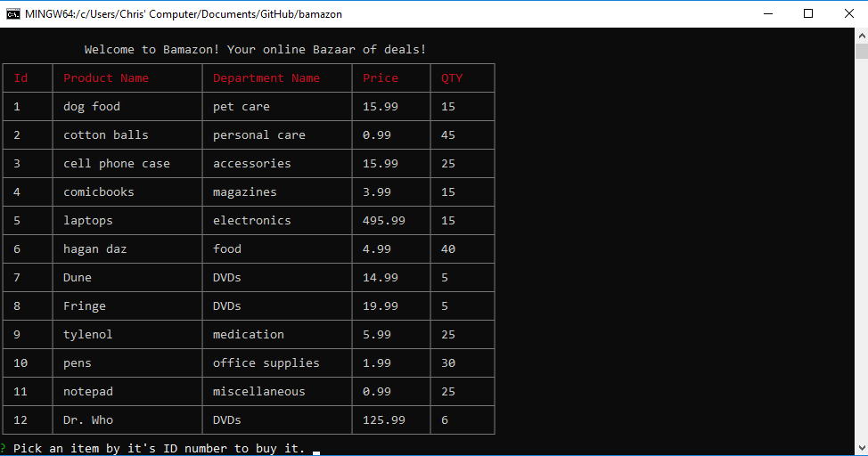
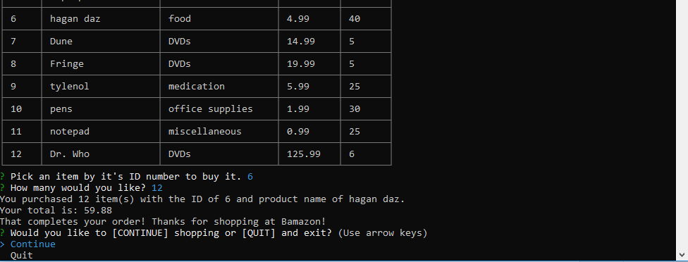
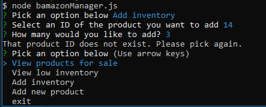

# bamazon

This program uses an inventory database and displays the results as a table. The user can choose a product and purchase it and the total will be displayed. If the user inputs the wrong info an arror message is displayed. 

    

 

 

    

   

